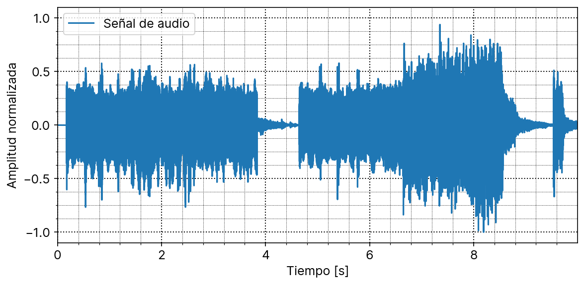
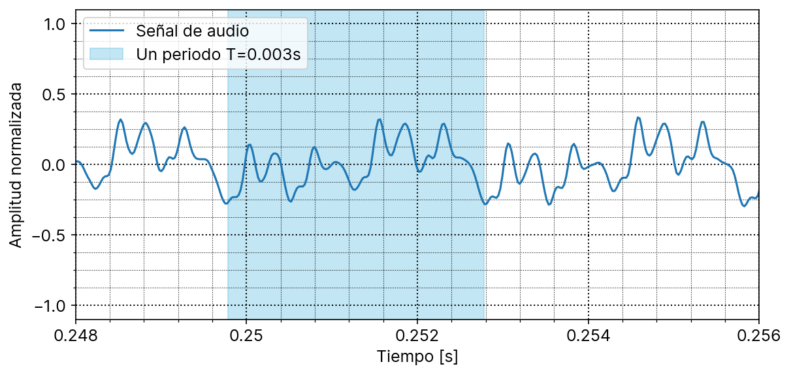
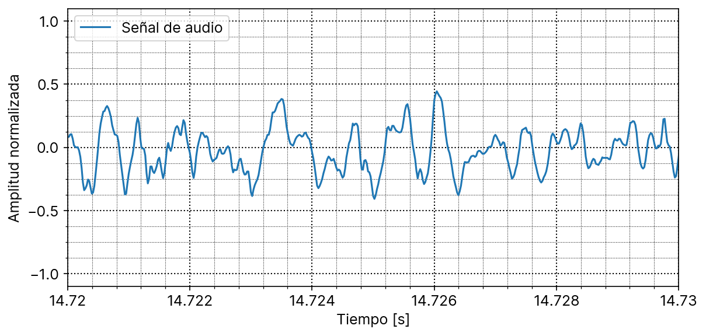
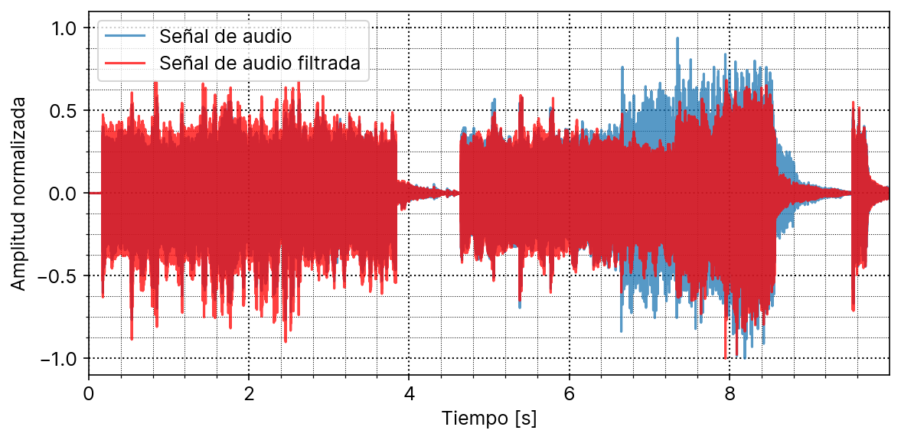
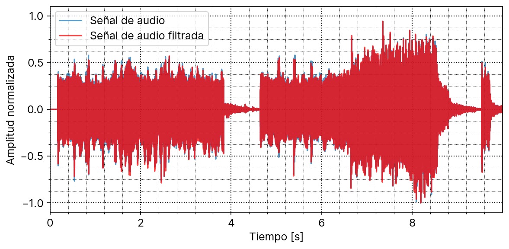
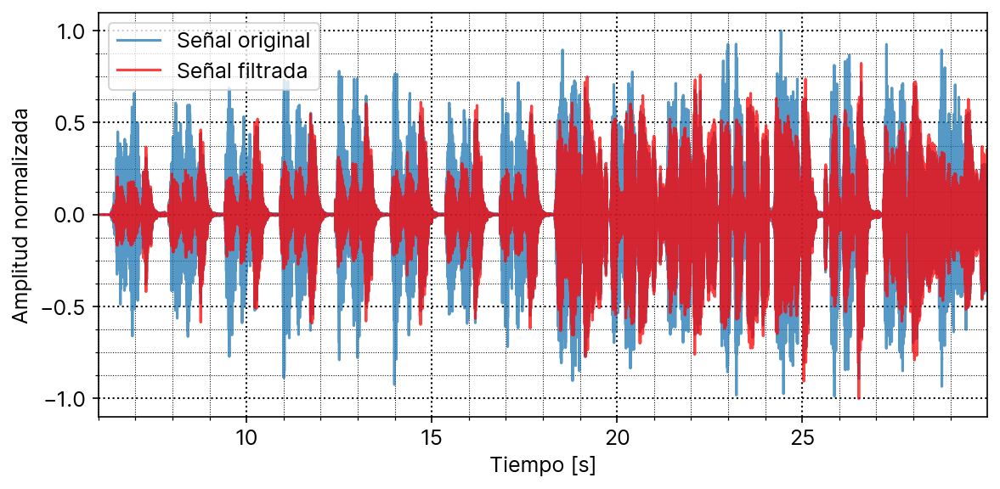
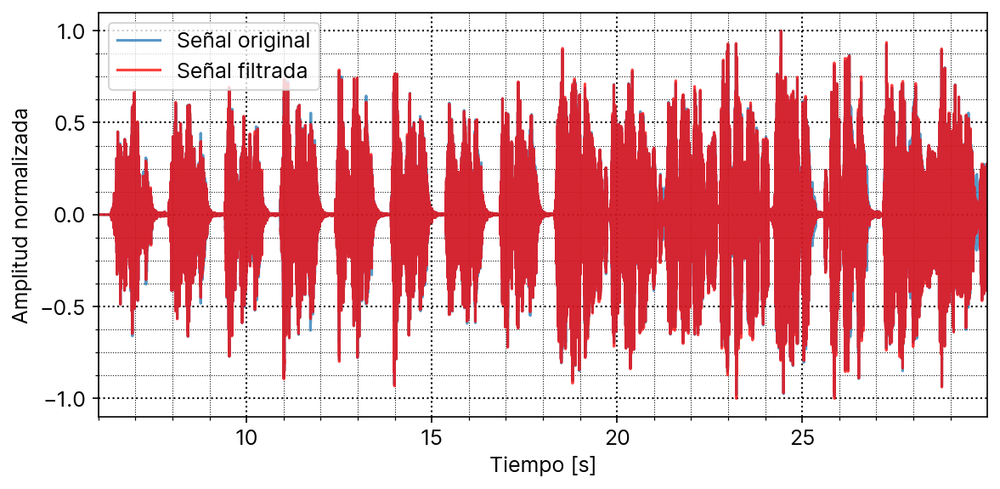
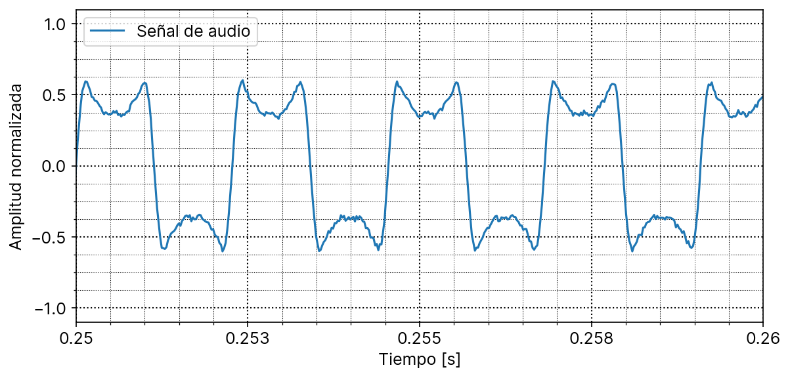
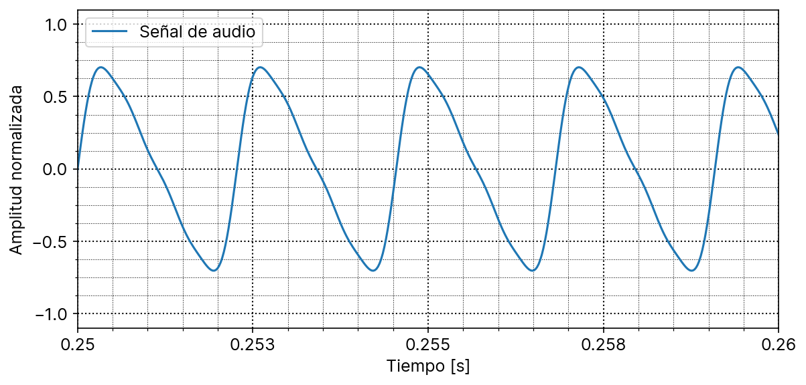
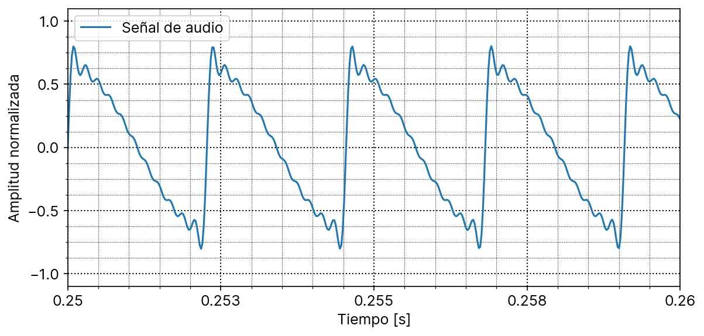

# Trabajo Práctico

Señales y sistemas (TB065) - FIUBA  

Martin Klöckner      - [mklockner@fi.uba.ar](mailto:mklockner@fi.uba.ar)  
Mateo Lema Roveta    - [mlema@fi.uba.ar](mailto:mlema@fi.uba.ar)  
Ernesto Dei Castelli - [edei@fi.uba.ar](mailto:edei@fi.uba.ar)  

\vspace{-0.50em}
\rule{\linewidth}{0.5pt}
\vspace{-1.00em}

En el presente trabajo se realiza un análisis en el dominio temporal de en
principio dos señales musicales de muestra, en las cuales se buscan porciones
cuasi-periódicas y no periódicas, y se luego se filtran utilizando dos filtros
diferentes. Y por ultimo, se generan mediante simulación de tres instrumentos
musicales diferentes tres señales, las cuales se analiza su forma en el dominio.

## Primer muestra

Para la primer muestra (archivo `cancion1.wav`) se realiza el gráfico de la
misma en el dominio temporal, el resultado se muestra en la figura 1.

La frecuencia de muestreo de la misma es 44100 Hz, esto se obtiene del mismo
script utilizado para graficar el archivo, en el cual se divide la cantidad de
muestras por la duración del archivo.

### Secciones cuasi-periódicas

Cuando la señal tiene una estructura repetitiva, pero con variaciones en
amplitud, fase o frecuencia se dice que la señal es cuasi-periódica.

Realizando un análisis visual en detalle de la muestra se buscan partes donde se
comporte como tal, dos ejemplos se dan en las figuras 2 y 3. En la primera se
gráfica el intervalo $0.248$ s a $0.256$ s, mientras que en la segunda se
gráfica el intervalo $0.520$ s a $0.528$ s.

Dentro de los intervalos cuasi-periódicos graficados, se pueden detectar
visualmente los períodos fundamentales, los cuales se ven resaltados en color
celeste claro.

Curiosamente en ambos casos el período es igual y resulta $T=0.003$ s,
lo cual corresponde con una frecuencia de aproximadamente $333$ Hz. Comparando
con notas musicales de tabla esto se asemeja a una nota *E4*, la cual tiene una
frecuencia de $329.228$ Hz. Siendo que el período se relaciona de manera inversa
con la frecuencia y esta de manera directa con la nota musical, se puede
asegurar que al disminuir este período la frecuencia aumentará y la nota musical
será mas aguda, mientras que en el caso contrario si aumenta el período la
frecuencia disminuye y también la nota musical.

## Segunda muestra

Utilizando el mismo script de python utilizado para la primer muestra (archivo
`cancion1.wav`) se gráfica la señal de la segunda muestra (correspondiente al
archivo `cancino2.wav`) en el dominio temporal, en este caso se gráfica a partir
del segundo 6 ya que antes de esto la señal tiene amplitud nula, con lo cual no
aporta información significativa, el gráfico resultante se muestra en la figura
4.

La frecuencia fundamental de esta segunda muestra resulta $48000$ Hz, esto
también se obtiene del script de python.

### Secciones no-periódicas

A diferencia del análisis realizado sobre la primer muestra en busca de
secciones cuasi-periódicas, para esta segunda muestra se buscan secciones no
periódicas, esto es, secciones donde la señal no tiene un patron repetitivo
marcado. Se toman dos intervalos en los cuales la señal de muestra se
comporta como tal, el intervalo de $14.72$s a $14.73$s y el intervalo $26.57$s a
$26.58$s, ambos intervalos se muestran graficados en las figura 5 y 6
respectivamente.

Dado que las secciones son no periódicas, no se puede hablar de una frecuencia
fundamental como si se podía en las secciones cuasi-periódicas en la primer
muestra.

## Filtrado

Para obtener la salida de la señal luego de pasarla por un filtro (respuesta al
impulso del primer filtro correspondiente al archivo `respuesta_impulso_1.txt` y
del segundo filtro correspondiente al archivo `respuesta_impulso_2.txt`) es
necesario realizar una convolución entre la señal de entrada y la respuesta al
impulso del filtro, esto suponiendo que el filtro es un sistema LTI (si no lo
fuera no se podría calcular la salida solo teniendo la respuesta al impulso).

La salida del filtro 1 al aplicar la primer muestra se puede ver en la figura 7,
en la figura se puede ver que atenúa partes de la señal y amplifica otras, en
particular amplifica principalmente antes del segundo $6$ y atenúa drásticamente
luego.

Aplicando el segundo filtro a la primer muestra resulta como se muestra e el
gráfico de figura 8. Se puede ver que esta a diferencia del filtro 1, no atenúa
o amplifica significativamente partes de la señal, si no que realiza una leve
atenuación de toda la señal.

De manera análoga para la segunda muestra se aplican los filtros mediante la
convolución entre la señal de muestra y la respuesta al impulso del respectivo
filtro. La salida de la segunda muestra al aplicar el primer y segundo filtro se
puede ver en las figuras 9 y 10 respectivamente.

Se puede ver claramente en la figura 9 que se atenúa la mayor parte de la señal
pero principalmente en la primera mitad (antes del segundo $18.5$
aproximadamente) y en menor medida en la mitad restante, aunque en partes de la
segunda mitad se atenúa drásticamente de todas formas, como por ejemplo en el
segundo $29$ en el que se atenúa aproximadamente un 70% de la señal.

En el caso del segundo filtro, de manera análoga a lo que ocurría con la primer
muestra, no se observa un cambio significativo en la señal filtrada, si no mas
bien una leve atenuación general, aunque si se percibe una drástica atenuación
de un instante especifico de la señal, en el segundo $29.9$ aproximadamente.

En todos los casos, tanto para la primer muestra como para la segunda y tanto
para el primer filtro como el segundo, escuchando la respectiva salida se
confirma lo analizado desde el punto de vista del gráfico de la señal, pero
ademas se aprecia que el primer filtro realiza una atenuación de las frecuencias
mas altas (sonidos agudos) mientras que el segundo disminuye las frecuencias
bajas (o sonidos graves) esto ultimo no se aprecia en el gráfico de la señal, ya
que parece no tener efecto mas que une leve atenuación.

## Sonido de diferentes instrumentos

Se generaron tres muestras diferentes a las ya utilizadas, correspondientes con
la nota *A4* (La4, $440$ Hz) mediante la simulación de tres instrumentos
musicales distintos: un clarinete, una flauta y un violin. Los gráficos de las
muestras resultantes se muestran en las figuras 11, 12 y 13, para el clarinete,
la flauta y el violin, respectivamente.

Si bien todos los sonidos tienen la misma frecuencia, ya que es la misma nota
musical, el sonido escuchado percibido es diferente, esto puede ser producto de
la forma de onda generada por cada instrumento, lo cual queda clara la
diferencia en los respectivos gráficos.

Cada sonido percibido tiene características diferentes, el mas apagado o neutro
es el producido por la flauta, mientras que el mas agudo o "afilado" es el
producido por el violin, el sonido del clarinete es un intermedio entre ambos,
un sonido ni muy agudo ni muy grave o apagado, y con cierto carácter metálico.

Para el caso del clarinete, cuya señal se puede ver en la figura 11 a
continuación se puede ver que la onda se parece a una onda cuadrada. En el
dominio de frecuencia, las ondas cuadradas ideales se componen de armónicos
impares.

Para la señal producida por la flauta que se puede ver en la figura 12, se puede
ver que se asemeja a una señal senoidal pura, aunque no tan simétrica en los
picos, las ondas sinodales en el dominio de frecuencia tienen un único armónico,
y es el fundamental, es por esto que el sonido es mas neutro y no tan
"brillante" o agudo dado que la frecuencia es la misma en todos los casos.

Por ultimo para para la señal producida por el violin, la cual se puede ver en
la figura 13, se asemeja a una onda triangular con pendiente decreciente, estas
ondas triangulares en el dominio de frecuencia también tienen armónicos impares
como la onda cuadrada, pero estos armónicos tienen mayor amplitud, es por esto
que si bien tienen un sonido similar, el sonido del violin es mas agudo.

